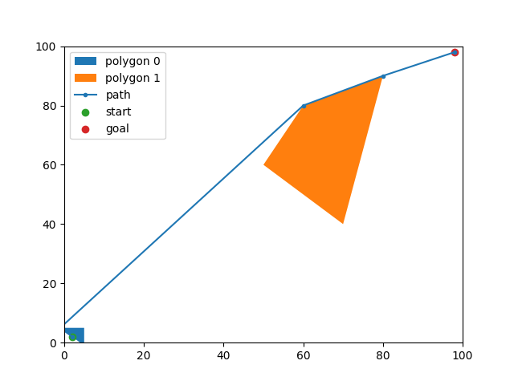

# 2D Path planning with obstacles

## Description

2D Path planning with obstacles is a Python code

## Installation

To install 2D Path planning with obstacles, you can use pip:

```zsh
pip install -r requirements.txt
```

## Requirements

- `numpy`
- `networkx`
- `shapely`
- `numpy`
- `matplotlib`
- `coloredlogs`

# How to use

1. Create a `configuration_file.yaml` file that contains the following structure:
   ```yaml
   x_start: 2
   y_start: 2
   x_goal: 98
   y_goal: 98
   x_space_size: 100
   y_space_size: 100
   list_obstacles: [[[5, 5], [10, 5], [8, 12]], [[50, 60], [70, 40], [80, 90], [60, 80]]]
   ```
1. Run the following command in your terminal
   - To show only the path coordinates
     ```zsh
     python3 pathPlanning.py <<CONFIGURATION_FILE_PATH>>
     ```
   - To show the path coordinates and plot
     ```zsh
     python3 pathPlanning.py <<CONFIGURATION_FILE_PATH>> --plot
     ```
1. You will get the path coordinates printed in your terminal, and a `solution.png` file in your current path.

# Exceptions

- If you don't add the right `configuration_file.yaml` file, and error will be raised
- If the `list_obstacles` inside `configuration_file.yaml` contains obstacles that intersect each other or the start or goal
- If not path is found

# Examples

- Successful execution:
  - Config
    ```yaml
    x_start: 2
    y_start: 2
    x_goal: 98
    y_goal: 98
    x_space_size: 100
    y_space_size: 100
    list_obstacles: [[[5, 5], [10, 5], [8, 12]], [[50, 60], [70, 40], [80, 90], [60, 80]]]
    ```
  - Output: `[[2.0, 2.0], [8.0, 12.0], [60.0, 80.0], [80.0, 90.0], [98.0, 98.0]]`
  - Plot: 

- Failed execution:
  - Config
    ```yaml
    x_start: 2
    y_start: 2
    x_goal: 98
    y_goal: 98
    x_space_size: 100
    y_space_size: 100
    list_obstacles: [[[5, -1], [-1, 5], [5, 5]], [[50, 60], [70, 40], [80, 90], [60, 80]]]
    ```
  - Output: `ERROR: 😕 No path found`
  - Plot (`This is just a visual aid`): 

# Logs example:

``` zsh
➜ python3 pathPlanning.py configuration_file.yaml --plot
2023-04-08 21:55:51 INFO: ⏳ Generating graph...
2023-04-08 21:55:51 INFO: ✅ Graph generated
2023-04-08 21:55:51 INFO: ⏳ Calculating graph...
2023-04-08 21:55:51 INFO: ✅ Path Calculated
2023-04-08 21:55:51 INFO: ✨ Path found: [<POINT (2 2)>, <POINT (8 12)>, <POINT (60 80)>, <POINT (80 90)>, <POINT (98 98)>]
2023-04-08 21:55:51 INFO: ✨ Result: [[2.0, 2.0], [8.0, 12.0], [60.0, 80.0], [80.0, 90.0], [98.0, 98.0]]
```

## License

2D Path planning with obstacles is licensed under the MIT License. See the LICENSE file for details.
